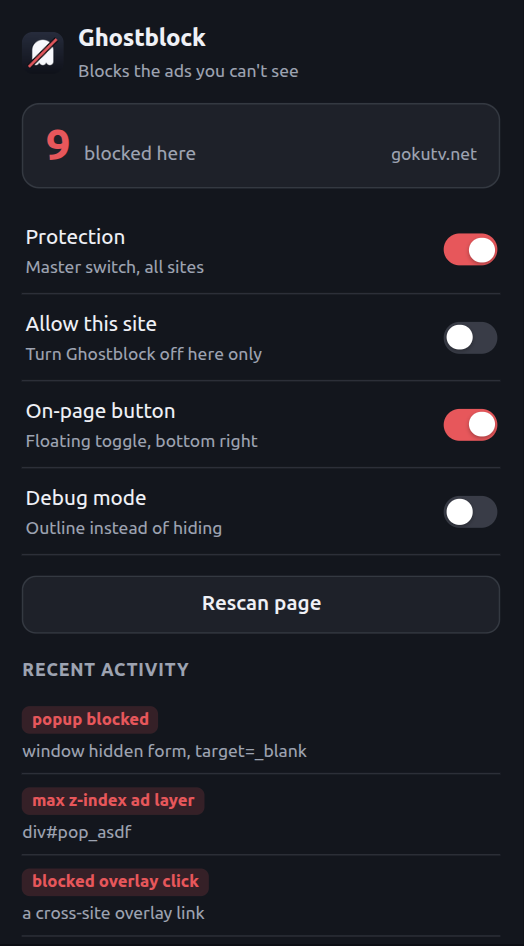

<p align="center">
  
</p>

<h1 align="center">Ghostblock</h1>

<p align="center">
  <b>Blocks the ads you can't see.</b><br>
  A Chrome extension for the invisible ad layer: click catchers over the play button,
  hidden frames, link hijacks, and popunders.
</p>

<p align="center">
  
  
  
</p>

---

You click play. A tab opens behind your window selling something. You never saw an ad, because there wasn't one to see: there was a transparent `<div>` sitting on top of the video, and your click landed on that instead.

Regular blockers hide banners. Ghostblock goes after the layer you can't see.

## What it blocks

- **Click catchers** — transparent full-page overlays parked on top of the player
- **Popunders** — including the ones that skip `window.open` and submit a hidden `target="_blank"` form instead
- **Hidden frames** — 1x1 tracker pixels, `opacity:0` frames, frames parked off-screen
- **Link hijacking** — invisible cross-site `<a>` elements stretched over the page
- **Cross-frame click relays** — a click in a nested player frame that fires a popunder on the top page
- **Ad networks** — ~70 domains, plus pattern rules that survive domain rotation

## Install

No web store listing yet, so load it unpacked:

```bash
git clone https://github.com/Nouman945/ghostblock.git
```

1. Open `chrome://extensions`
2. Turn on **Developer mode** (top right)
3. Click **Load unpacked** and pick the cloned folder

Chrome 111+. No build step, no dependencies.

## Using it



The toolbar popup shows what got blocked on the tab, and which rule caught each item.

- **Protection** — master switch, all sites
- **Allow this site** — turn it off for one site only
- **On-page button** — a floating pill, bottom right, showing the live count. Click it to switch the current site off. Lives in a closed shadow root so page CSS can't touch it.
- **Debug mode** — outlines suspects in red instead of hiding them

New site you care about? Turn on debug mode first and see what it would touch before trusting it. If something breaks, the popup names the exact element and rule that fired.

<br clear="right">

## It shouldn't break your video

That's the hard part of this kind of blocker, so it's worth saying how it's handled. Player chains nest several cross-origin frames, which makes the real player look exactly like an ad frame. Four guards:

- Anything that is, or wraps, a large frame is treated as content, never an ad
- Frame rules wait for layout, because a frame measured too early reports `0x0` and reads as a tracker pixel
- A frame seen at player size once is exempt permanently, so hidden-then-reshown players survive
- Elements that are `visibility:hidden` or `display:none` are skipped — they can't receive a click, so they can't be catching one

That last rule is why closed modals and lightboxes survive. Trailer modals are typically full-viewport with `opacity: 0`, which otherwise looks identical to a click catcher.

## How it works

| File | Role |
|---|---|
| `src/main-world.js` | Runs in the page's JS world at `document_start`. Patches `window.open`, anchor `click`, form `submit`, and `contentWindow`. |
| `src/content.js` | Classifies elements on mutation and on a timer. Peels ad layers out from under the pointer before a click resolves. |
| `rules/network.json` | declarativeNetRequest blocklist and pattern rules. |

Two details worth knowing, because they're what these SDKs actually do:

**They check whether you patched them.** The SDK runs `open.toString().includes('[native code]')` before every call. If it sees a patch, it builds a throwaway `about:blank` iframe and calls *that* realm's clean `open`. So `Function.prototype.toString` is spoofed to keep hooks reading as native, and `contentWindow` is wrapped to patch child realms too.

**Their domains rotate.** The ad host is hash-generated per 3-hour bucket with a fallback domain and `onerror` failover. Domain blocklists rot by design, so the real defense is the behavioural layer. The network rules are a bonus.

## Tuning

- `SAFE_HOSTS` in `src/content.js` — third parties that legitimately load hidden frames (reCAPTCHA, Stripe, PayPal, YouTube/Vimeo embeds)
- `classify()` thresholds — viewport coverage and z-index cutoffs
- `rules/network.json` — add domains you see in DevTools Network
- `src/hide.css` — static rules, applied before any JS runs

## Limits

- `baseDomain()` takes the last two labels, so `foo.co.uk` and `bar.co.uk` read as same-site
- Handles the hidden layer only. Run it alongside uBlock Origin for visible banners
- On an allowlisted site, patches are active for a few ms before the stand-down message arrives. No clean fix in MV3

## Research

[`docs/research.md`](docs/research.md) has the full teardown of the ad SDKs on two streaming sites: the popunder mechanism, the five ways the ads re-inject themselves, the anti-analysis tricks, and the false positives that cost a working trailer modal. That's where the rules above come from.

## Contributing

Issues and PRs welcome, especially new ad-layer patterns from sites in the wild. Include the element, its computed style, and the site if you can share it.

## License

MIT
